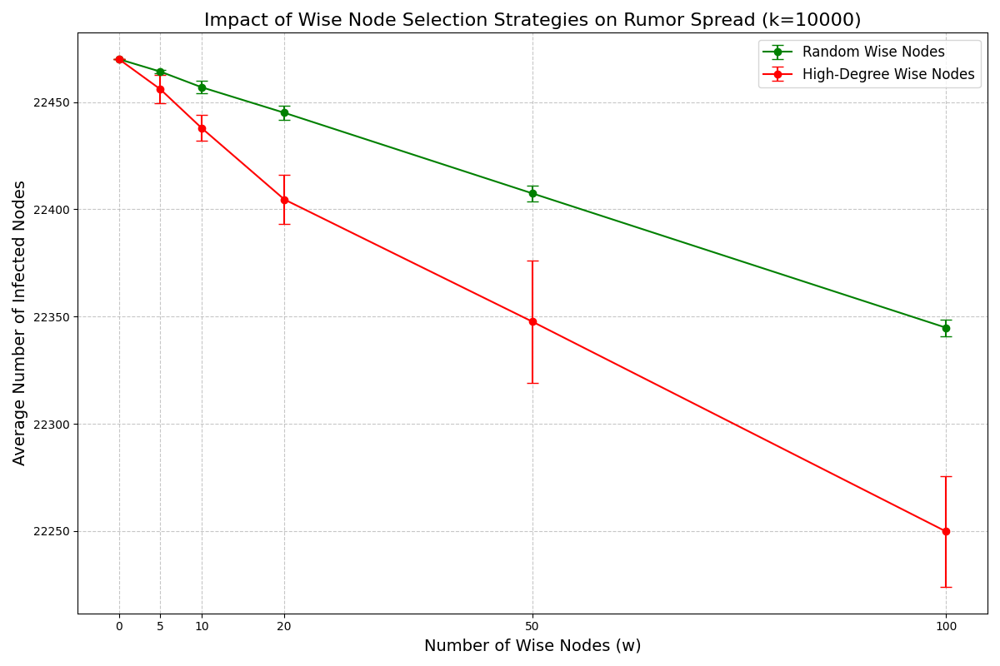

# Wise Node Strategy for Rumor Mitigation in Social Networks

This project explores **rumor mitigation strategies** in social networks using a Binary Response Dynamics (BRD) contagion model. By introducing **wise nodes** that disseminate accurate information, we analyze and demonstrate methods to effectively reduce the spread of rumors.

## Features

- Simulates rumor propagation in large-scale social networks.
- Implements **Random** and **High-Degree Selection** strategies for wise node placement.
- Supports customizable thresholds, network configurations, and experimental parameters.
- Provides reproducible experiments on the MUSAE Facebook dataset.

## Background

Social networks can facilitate rapid dissemination of rumors, leading to misinformation and societal disruptions. This project employs a contagion model to understand how **wise nodes**—strategically placed individuals disseminating accurate information—can control rumor spread.

### Key Highlights

- Dataset: The [MUSAE Facebook dataset](https://arxiv.org/abs/1909.13021) with 22,470 nodes and 171,002 edges.
- Simulation: A Binary Response Dynamics model with nodes transitioning between:
  - `X`: Rumor-infected nodes.
  - `Y`: Uninfected nodes.
  - `W`: Wise nodes spreading accurate information.
- Strategies:
  - **Random Selection**: Wise nodes are chosen randomly.
  - **High-Degree Selection**: Wise nodes are chosen based on degree centrality.

## Installation

1. Clone the repository:

   ```bash
   git clone git@github.com:yewentao256/Wise-Node-Rumor-Control.git
   cd Wise-Node-Rumor-Control
   ```

2. Install dependencies:
   - Python 3.8 or higher
   - Required libraries:

     ```bash
     pip install numpy matplotlib
     ```

## Usage

### Run Experiments

To simulate rumor spread with different configurations:

```bash
python main.py
```

### Outputs

- The simulation generates and saves plots like these:
  - `rumor_spread_k10.png`: Impact of wise nodes with \( k = 10 \) initial rumor spreaders.
  - `rumor_spread_k100.png`, `rumor_spread_k1000.png`, and so on.
- Results are displayed in the console.

## Example Results

Here are some key findings from the experiments:

- Introducing wise nodes significantly reduces the spread of rumors, especially with high-degree selection.
- As the number of wise nodes increases, the rumor spread diminishes proportionally.

### Example Plot



